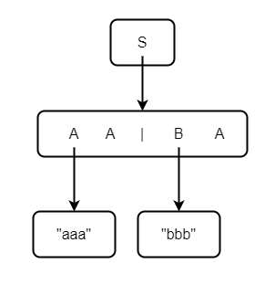
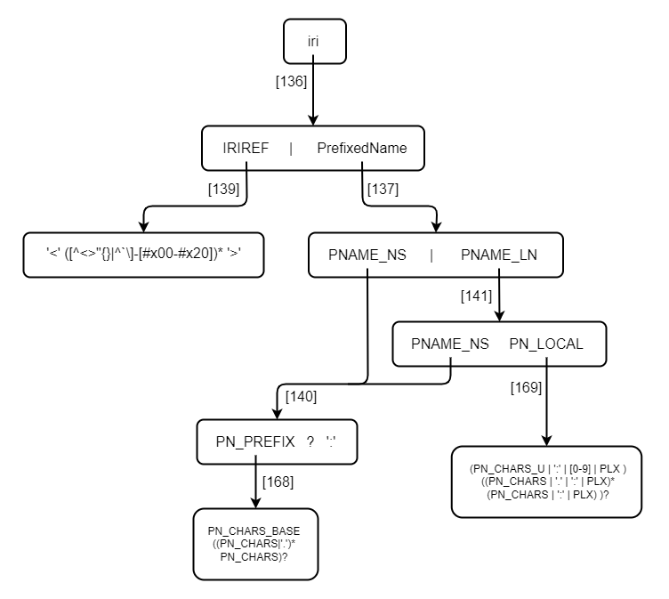
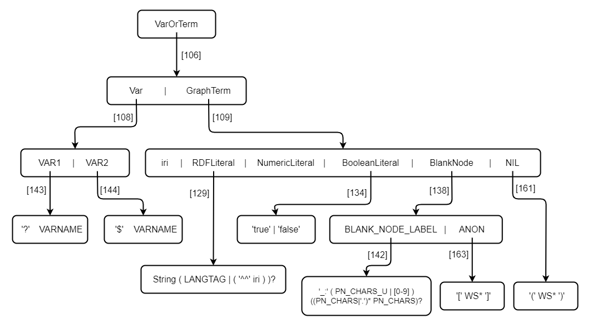
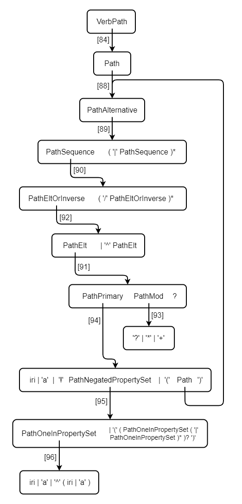
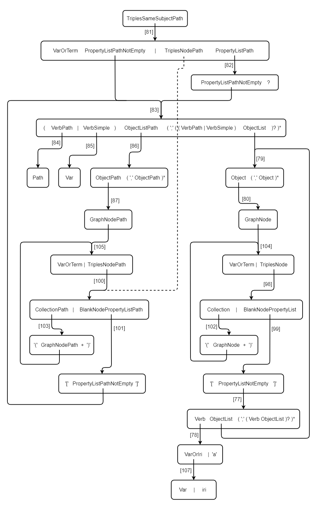
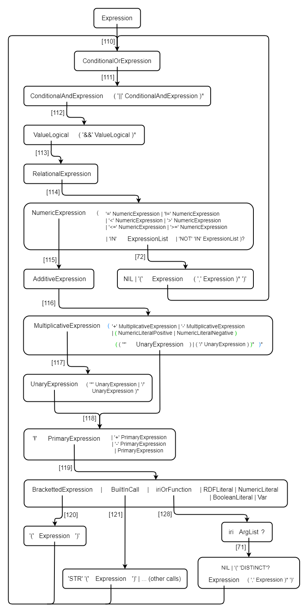
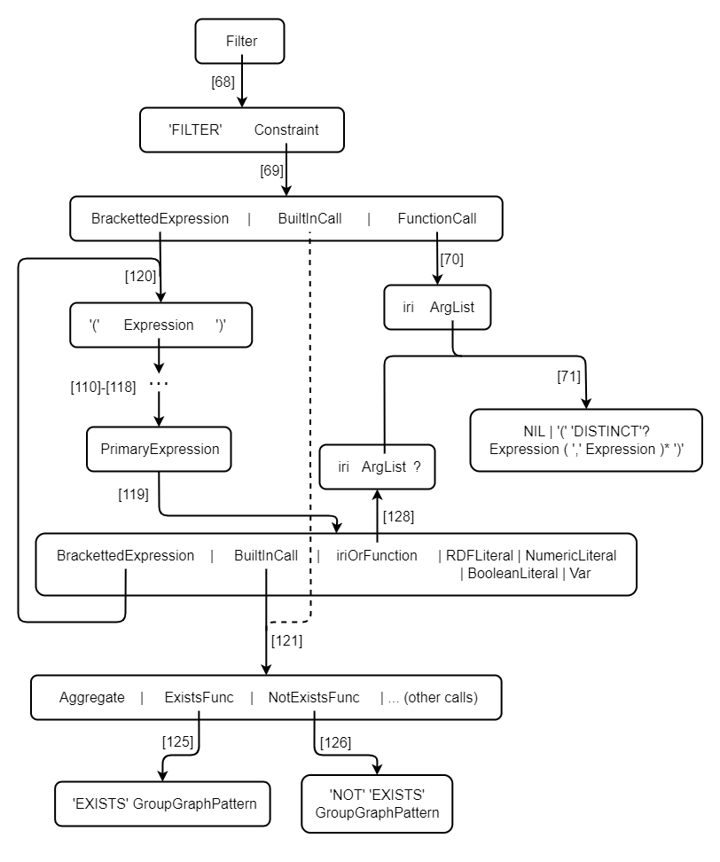
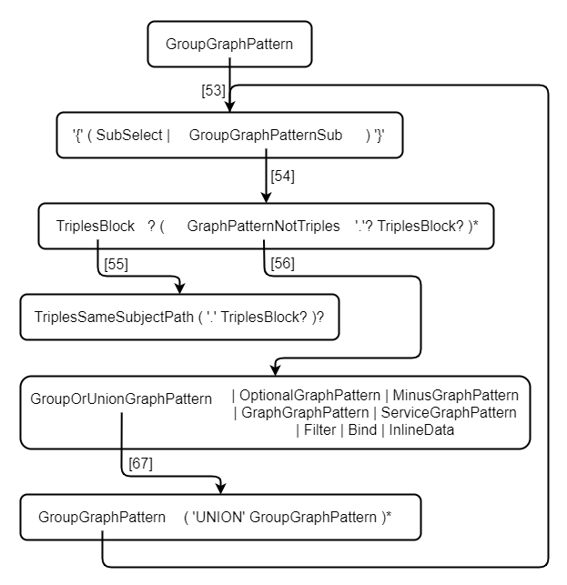

# SPARQL 1.1 BNF浅析

本文已在Github开源，可前往查看：https://github.com/qmj0923/SPARQL11-introduction

相关资料和工具：

- **如果从未接触过SPARQL，请先阅读和学习[SPARQL文档导读](./SPARQL文档导读)**
- SPARQL 1.1的BNF（官方文档）：https://www.w3.org/TR/2013/REC-sparql11-query-20130321/#sparqlGrammar
- 对SPARQL查询做语法解析的Python工具：https://github.com/qmj0923/SPARQL-PLY

## BNF范式初步

### 概念

**语言**是由字符串构成的集合。例如“SPARQL查询语言”就是所有合法的SPARQL查询语句构成的集合。SPARQL查询语言是一种**上下文无关语言**，可以用BNF范式来表示。简单来说，每个上下文无关语言$G$包含一个**初始符号**和一些**推导规则**。对于一个字符串$w$，假如存在一系列规则，使得能够从初始符号通过它们推导得到$w$，那么称字符串$w$属于语言$G$。

BNF范式是推导规则的集合，写为：

```
<符号> ::= <使用符号的表达式>
```

<使用符号的表达式>由一个符号序列构成，或由竖杠`|`分隔的多个符号序列构成。每个符号序列整体都是左端的符号的一种可能的替代。

若无特殊说明，符号序列中各符号所推导出的子串之间可以有零个或多个空格。

### 例1

举个例子，令语言$G_1$的初始符号为`S`，推导规则如下：

```
S ::= A A | B A
A ::= 'aaa'
B ::= 'bbb'
```

竖杠`|`表示选择一个符号序列进行推导。`S ::= A A | B A`表示`S`要么推导成符号序列`A A`，要么推导成符号序列`B A`。字符串“bbb aaa”属于语言$G_1$，因为可以从`S`出发，经过如下推导得到它：

```
S -> B A -> 'bbb' 'aaa'
```

### 例2

考虑一个稍微复杂一点的例子。语言$G_2$表示嵌套的括号，即字符串前半部分有n个左括号，后半部分有n个右括号（$n>0$）。形如：

```
((((...))))
```

其BNF范式可写为：

```
S ::= '(' ')' | '(' S ')'
```

字符串“((()))”属于语言$G_2$，因为它可以通过如下推导得到：

```
S -> '(' S ')' -> '(' '(' S ')' ')' -> '(' '(' '(' ')' ')' ')'
```

### 例3

最后展示一个实用些的例子。本例中将会使用扩展的BNF范式，参见[文档](https://www.w3.org/TR/xml11/#sec-notation)。SPARQL的BNF也采用了该规范。

语言$G_3$表示整数的四则运算，其初始符号为`expr`，推导规则如下：

```
multop  ::= '*' | '/'
addop   ::= '+' | '-'
integer ::= [+-]? [0-9]+
atom    ::= integer | '(' expr ')'
term    ::= atom ( multop atom )*
expr    ::= term ( addop term )*
```

我们通过两个该语言的字符串来理解上述BNF。首先是“3 * 2 + 4”：

```
expr -> term addop term
# 上式右端第一个term推导到atom multop atom，第二个term推导到atom。即：
-> atom multop atom '+' atom
-> integer '*' integer '+' integer
-> '3' '*' '2' '+' '4'
```

把解析的过程画成一棵树的形状：

```
                     expr
                  /    |   \
                /      |    \
              /        |     \
           term      addop   term
         /  |  \       |      |
        /   |   \      |      |
     atom mulop atom  '+'    atom
      |     |     |           |
      |     |     |           |
     '3'   '*'   '2'         '4'
```

可以发现，通过语言$G_3$的BNF来解析字符串，可以很好地处理运算优先级的问题。我们对解析树自底向上进行计算，先计算“3 * 2”得“6”，再计算“6 + 4”。这是符合四则运算优先级的。

再分析字符串“(2 + 1) * 2 + 4”，我们直接来画解析树：

```
                           expr
                        /    |   \
                     /       |    \
                  /          |     \
                term       addop   term
              /   |  \       |      |
            /     |   \      |      |
          /       |    \     |      |
        atom    mulop atom  '+'    atom
      /  |  \     |    |            |
    /    |   \    |    |            |
  '('  expr  ')' '*'  '2'          '4'
       / | \
     /   |  \
   /     |   \
term   addop  term
  |      |     |
  |      |     |
atom    '+'   atom
  |            |
  |            |
 '2'          '1'
```

与上面的例子对比可以发现，括号括起来的子表达式“(2+1)”相当于一棵子树，替换了原来整数“3”所在的节点。由于括号的优先级是最高的，且括起来的子表达式求值结果为整数，所以在BNF中可以把它视作“与整数同一层级的符号”（即`atom ::= integer | '(' expr ')'`）。

### 本文档中BNF的图例表示

在本文档中的BNF图例中，对于一个BNF`<符号> ::= <使用符号的表达式>`，会有一个箭头从<符号>指向<使用符号的表达式>。每个<使用符号的表达式>都会被一个圆角矩形框起来。单独出现的符号也会被圆角矩形框起来（美观起见）。

下图表示的是例1的BNF。



## SPARQL-BNF图解

本节将“自底向上”地解释SPARQL的BNF。从IRI开始，一直到图模式组（GroupGraphPattern）为止。本文档力求将SPARQL中那些不易理解的BNF用形象的图例来展示清楚。

接下来的内容将辅以一个例子来解释。下面的SPARQL语句查询了book:somebody所创作的书籍。

```
PREFIX book: <http://example.org/book/>
SELECT ?x WHERE {
    ?x book:author book:somebody.  # ?x的作者是book:somebody
}
```

### 国际化资源标识符（IRI）

一个IRI要么是由尖括号包围的IRI引用，要么形如`前缀名+冒号+局部名`。图例如下所示，其中以“PN_CHARS”开头的符号最终会推导出某个字符，PLX推导出的是转义字符。



举例来说：

- `<http://example.org/book/>`是一个IRI，可由符号iri通过[136]、[139]推导得到。
- book:somebody也是一个IRI，可由符号iri通过[136]、[137]、[141]推导得到。

### 三元组模式

#### 变量和图中的项

前面的例子中，WHERE子句里存在一个三元组模式。不难看出，三元组的主语和宾语位置可以出现变量、IRI等内容。在SPARQL的BNF中，符号“VarOrTerm”对应了这种情况。该符号推导出子串只能处于主语或宾语位置。图例如下所示，其中VARNAME和String都是合法字符组成的字符串；NumericLiteral包括正负整数浮点数等；WS表示空白符。



用例子来解释一下：

- `?x`由VarOrTerm通过[106]、[108]、[143]推导得到。
- `book:somebody`由VarOrTerm先通过[106]、[109]推导得到iri，再经过[136]、[137]、[141]得到最终结果（参见iri的图例）。

图例较为直观地展示出，VarOrTerm能够推导出变量、IRI、字面量等。继而注意到，SPARQL的BNF是允许字面量出现在主语位置的，这与惯例并不相符。

#### 属性路径

上面例子所查得的结果是书籍的IRI。假如我们想要获取书籍的名称，则可以像下面这样来查询。

```
PREFIX book: <http://example.org/book/>
PREFIX rdfs: <http://www.w3.org/2000/01/rdf-schema#>
SELECT ?bookname WHERE {
    ?x book:author book:somebody.        # ?x的作者是book:somebody
    ?x book:title|rdfs:label ?bookname.  # ?x的名称是?bookname
}
```

`book:title|rdfs:label`是一条**属性路径**，其定义详见[文档](https://www.w3.org/TR/2013/REC-sparql11-query-20130321/#propertypaths)。文档中规定了`^`、`/`、`|`等操作符的优先级。从下面的图例中可以看出，BNF的设计是符合优先级定义的（相关讨论见前文“BNF范式初步”的例3）。



#### 空白节点和谓词-宾语列表

三元组模式中可以出现空白节点，也可以出现谓词-宾语列表。文档链接如下。

```
https://www.w3.org/TR/2013/REC-sparql11-query-20130321/#QSynBlankNodes
https://www.w3.org/TR/2013/REC-sparql11-query-20130321/#predObjLists
```

三元组模式的BNF非常容易看岔符号。图例如下所示。对比左右两条支线，有些符号只相差一个“Path”，需要仔细甄别。



同样通过例子来进行解释。我们来分析三元组模式`?x book:author book:somebody`。

```
# 从最顶端的TriplesSameSubjectPath开始，首先通过[81]推导得：
TriplesSameSubjectPath -> VarOrTerm PropertyListPathNotEmpty
# 上面的VarOrTerm会通过[106]、[108]、[143]，最终推导到?x（参见VarOrTerm的图例）。
# 接下来看PropertyListPathNotEmpty。根据[83]有：
PropertyListPathNotEmpty -> VerbPath ObjectListPath
# VerbPath会先通过[84]、[88]、[89]、[90]、[92]、[91]、[94]推导到iri（见VerbPath的图例），再经过[136]、[137]、[141]（参见iri的图例），最终得到book:author。
# ObjectListPath先通过[86]、[87]、[105]推导到VarOrTerm，然后通过[106]、[109]推导到iri，最终得到book:somebody。
```

左右两条支线最主要的区别在于，对于形如下述的谓词-宾语列表，假如存在宾语是空白节点，那么只有第一行的宾语（obj_1_X）所对应的空白节点中可以存在属性路径。

```
subj pred_1 obj_1_1, obj_1_2, obj_1_3,...;
     pred_2 obj_2_1, obj_2_2, obj_2_3,...;
     pred_3 obj_3_1, obj_3_2, obj_3_3,...;
     ...
```

举个例子：

```
# 合法的三元组
?x ?y1 [p1|p2 ?z1]; ?y2 [p3 ?z2]
# 不合法的三元组
?x ?y1 [p1|p2 ?z1]; ?y2 [p3|p4 ?z2]
```

> 注：Wikidata没有完全按照上述规定来实现。比如下面这段查询并不符合SPARQL语法，但在[Wikidata官方查询网站](query.wikidata.org)中却能正常执行。
>
> ```
> SELECT ?x ?y ?tx ?ty WHERE {
>   wd:Q253414 p:P856 [ps:P856 ?x; pq:P813 ?tx ];
>              p:P488 [ps:P488 ?y; pq:P580|pq:P582 ?ty ];
> }
> ```

### 表达式和过滤器

稍稍拓展一下前文的例子。

```
PREFIX book: <http://example.org/book/>
SELECT ?x WHERE {
    ?x book:price ?price .  # ?x的售价是?price
    FILTER (?price < 30)    # 筛选?price小于30的书籍
}
```

#### 表达式

上面的例子中，关键字`FILTER`后面括号中的`?price < 30`就是一个表达式。图例如下所示。



具体解释一下`?price < 30`的推导过程：

```
# 从最顶端的Expression开始，首先通过[110]、[111]、[112]、[113]、[114]推导得：
Expression
-> ConditionalOrExpression
-> ConditionalAndExpression
-> ValueLogical
-> RelationalExpression
-> NumericExpression '<' NumericExpression

# 此处两个NumericExpression都会通过[115]、[116]、[117]、[118]推导到PrimaryExpression：
NumericExpression
-> AdditiveExpression
-> MultiplicativeExpression
-> UnaryExpression
-> PrimaryExpression

# 然后'<'左侧的PrimaryExpression会通过[119]推导到Var，最终通过[108]、[143]得到?price（参见VarOrTerm的图例）。
# '<'右侧的PrimaryExpression会通过[119]推导到NumericLiteral，最终得到30（此部分推导请直接阅读SPARQL官方文档）。
```

此外提供一个更复杂的表达式如下，可以借助它来进一步理解图例。具体推导过程不再赘述。

```
isNUMERIC(?price) && ?tip + ?price * xsd:integer(?num) > 100 || STR(?price) = 'INF'
```

#### 过滤器（Filter）

理解表达式之后，再看Filter的结构就比较清楚了。这里直接展示图例。



### 图模式组

最后是图模式组的图例。



仍然通过例子来解释。以下是一个图模式组：

```
{
    ?x book:price ?price . 
    FILTER (?price < 30) 
}
```

推导过程如下：

```
# 从最顶端的GroupGraphPattern开始，首先通过[53]、[54]推导得：
GroupGraphPattern
-> '{' GroupGraphPatternSub '}'
-> '{' TriplesBlock GraphPatternNotTriples '}'

# TriplesBlock最终会推导得`?x book:price ?price .`（参见TriplesSameSubjectPath的图例）
TriplesBlock -> TriplesSameSubjectPath '.'

# GraphPatternNotTriples最终会推导得`FILTER (?price < 30)`（参见Filter和Expression的图例）
GraphPatternNotTriples -> Filter 
```

## SPARQL-BNF分类

SPARQL 1.1共173个BNF，分类如下。

### Terminal

```
[139] IRIREF ::= '<' ([^<>"{}|^`\]-[#x00-#x20])* '>'
[140] PNAME_NS ::= PN_PREFIX? ':'
[141] PNAME_LN ::= PNAME_NS PN_LOCAL
[142] BLANK_NODE_LABEL ::= '_:' ( PN_CHARS_U | [0-9] ) ((PN_CHARS|'.')* PN_CHARS)?
[143] VAR1 ::= '?' VARNAME
[144] VAR2 ::= '$' VARNAME
[145] LANGTAG ::= '@' [a-zA-Z]+ ('-' [a-zA-Z0-9]+)*
[146] INTEGER ::= [0-9]+
[147] DECIMAL ::= [0-9]* '.' [0-9]+
[148] DOUBLE ::= [0-9]+ '.' [0-9]* EXPONENT | '.' ([0-9])+ EXPONENT | ([0-9])+ EXPONENT
[149] INTEGER_POSITIVE ::= '+' INTEGER
[150] DECIMAL_POSITIVE ::= '+' DECIMAL
[151] DOUBLE_POSITIVE ::= '+' DOUBLE
[152] INTEGER_NEGATIVE ::= '-' INTEGER
[153] DECIMAL_NEGATIVE ::= '-' DECIMAL
[154] DOUBLE_NEGATIVE ::= '-' DOUBLE
[155] EXPONENT ::= [eE] [+-]? [0-9]+
[156] STRING_LITERAL1 ::= "'" ( ([^#x27#x5C#xA#xD]) | ECHAR )* "'"
[157] STRING_LITERAL2 ::= '"' ( ([^#x22#x5C#xA#xD]) | ECHAR )* '"'
[158] STRING_LITERAL_LONG1 ::= "'''" ( ( "'" | "''" )? ( [^'\] | ECHAR ) )* "'''"
[159] STRING_LITERAL_LONG2 ::= '"""' ( ( '"' | '""' )? ( [^"\] | ECHAR ) )* '"""'
[160] ECHAR ::= '\' [tbnrf\"']
[161] NIL ::= '(' WS* ')'
[162] WS ::= #x20 | #x9 | #xD | #xA
[163] ANON ::= '[' WS* ']'
[164] PN_CHARS_BASE ::= [A-Z] | [a-z] | [#x00C0-#x00D6] | [#x00D8-#x00F6] | [#x00F8-#x02FF] | [#x0370-#x037D] | [#x037F-#x1FFF] | [#x200C-#x200D] | [#x2070-#x218F] | [#x2C00-#x2FEF] | [#x3001-#xD7FF] | [#xF900-#xFDCF] | [#xFDF0-#xFFFD] | [#x10000-#xEFFFF]
[165] PN_CHARS_U ::= PN_CHARS_BASE | '_'
[166] VARNAME ::= ( PN_CHARS_U | [0-9] ) ( PN_CHARS_U | [0-9] | #x00B7 | [#x0300-#x036F] | [#x203F-#x2040] )*
[167] PN_CHARS ::= PN_CHARS_U | '-' | [0-9] | #x00B7 | [#x0300-#x036F] | [#x203F-#x2040]
[168] PN_PREFIX ::= PN_CHARS_BASE ((PN_CHARS|'.')* PN_CHARS)?
[169] PN_LOCAL ::= (PN_CHARS_U | ':' | [0-9] | PLX ) ((PN_CHARS | '.' | ':' | PLX)* (PN_CHARS | ':' | PLX) )?
[170] PLX ::= PERCENT | PN_LOCAL_ESC
[171] PERCENT ::= '%' HEX HEX
[172] HEX ::= [0-9] | [A-F] | [a-f]
[173] PN_LOCAL_ESC ::= '\' ( '_' | '~' | '.' | '-' | '!' | '$' | '&' | "'" | '(' | ')' | '*' | '+' | ',' | ';' | '=' | '/' | '?' | '#' | '@' | '%' )
```

### Var and GraphTerm

```
[106] VarOrTerm ::= Var | GraphTerm
[108] Var ::= VAR1 | VAR2
[109] GraphTerm ::= iri | RDFLiteral | NumericLiteral | BooleanLiteral | BlankNode | NIL
[129] RDFLiteral ::= String ( LANGTAG | ( '^^' iri ) )?
[130] NumericLiteral ::= NumericLiteralUnsigned | NumericLiteralPositive | NumericLiteralNegative
[131] NumericLiteralUnsigned ::= INTEGER | DECIMAL | DOUBLE
[132] NumericLiteralPositive ::= INTEGER_POSITIVE | DECIMAL_POSITIVE | DOUBLE_POSITIVE
[133] NumericLiteralNegative ::= INTEGER_NEGATIVE | DECIMAL_NEGATIVE | DOUBLE_NEGATIVE
[134] BooleanLiteral ::= 'true' | 'false'
[135] String ::= STRING_LITERAL1 | STRING_LITERAL2 | STRING_LITERAL_LONG1 | STRING_LITERAL_LONG2
[136] iri ::= IRIREF | PrefixedName
[137] PrefixedName ::= PNAME_LN | PNAME_NS
[138] BlankNode ::= BLANK_NODE_LABEL | ANON
```

### Path

```
[88] Path ::= PathAlternative
[89] PathAlternative ::= PathSequence ( '|' PathSequence )*
[90] PathSequence ::= PathEltOrInverse ( '/' PathEltOrInverse )*
[91] PathElt ::= PathPrimary PathMod?
[92] PathEltOrInverse ::= PathElt | '^' PathElt
[93] PathMod ::= '?' | '*' | '+'
[94] PathPrimary ::= iri | 'a' | '!' PathNegatedPropertySet | '(' Path ')'
[95] PathNegatedPropertySet ::= PathOneInPropertySet | '(' ( PathOneInPropertySet ( '|' PathOneInPropertySet )* )? ')'
[96] PathOneInPropertySet ::= iri | 'a' | '^' ( iri | 'a' )
```

### Triples Block

```
[55] TriplesBlock ::= TriplesSameSubjectPath ( '.' TriplesBlock? )?
[77] PropertyListNotEmpty ::= Verb ObjectList ( ';' ( Verb ObjectList )? )*
[78] Verb ::= VarOrIri | 'a'
[79] ObjectList ::= Object ( ',' Object )*
[80] Object ::= GraphNode
[81] TriplesSameSubjectPath ::= VarOrTerm PropertyListPathNotEmpty | TriplesNodePath PropertyListPath
[82] PropertyListPath ::= PropertyListPathNotEmpty?
[83] PropertyListPathNotEmpty ::= ( VerbPath | VerbSimple ) ObjectListPath ( ';' ( ( VerbPath | VerbSimple ) ObjectList )? )*
[84] VerbPath ::= Path
[85] VerbSimple ::= Var
[86] ObjectListPath ::= ObjectPath ( ',' ObjectPath )*
[87] ObjectPath ::= GraphNodePath
[98] TriplesNode ::= Collection | BlankNodePropertyList
[99] BlankNodePropertyList ::= '[' PropertyListNotEmpty ']'
[100] TriplesNodePath ::= CollectionPath | BlankNodePropertyListPath
[101] BlankNodePropertyListPath ::= '[' PropertyListPathNotEmpty ']'
[102] Collection ::= '(' GraphNode+ ')'
[103] CollectionPath ::= '(' GraphNodePath+ ')'
[104] GraphNode ::= VarOrTerm | TriplesNode
[105] GraphNodePath ::= VarOrTerm | TriplesNodePath
[107] VarOrIri ::= Var | iri
```

### Expression

```
[71] ArgList ::= NIL | '(' 'DISTINCT'? Expression ( ',' Expression )* ')'
[72] ExpressionList ::= NIL | '(' Expression ( ',' Expression )* ')'
[110] Expression ::= ConditionalOrExpression
[111] ConditionalOrExpression ::= ConditionalAndExpression ( '||' ConditionalAndExpression )*
[112] ConditionalAndExpression ::= ValueLogical ( '&&' ValueLogical )*
[113] ValueLogical ::= RelationalExpression
[114] RelationalExpression ::= NumericExpression ( '=' NumericExpression | '!=' NumericExpression | '<' NumericExpression | '>' NumericExpression | '<=' NumericExpression | '>=' NumericExpression | 'IN' ExpressionList | 'NOT' 'IN' ExpressionList )?
[115] NumericExpression ::= AdditiveExpression
[116] AdditiveExpression ::= MultiplicativeExpression ( '+' MultiplicativeExpression | '-' MultiplicativeExpression | ( NumericLiteralPositive | NumericLiteralNegative ) ( ( '*' UnaryExpression ) | ( '/' UnaryExpression ) )* )*
[117] MultiplicativeExpression ::= UnaryExpression ( '*' UnaryExpression | '/' UnaryExpression )*
[118] UnaryExpression ::= '!' PrimaryExpression
                          | '+' PrimaryExpression
                          | '-' PrimaryExpression
                          | PrimaryExpression
[119] PrimaryExpression ::= BrackettedExpression | BuiltInCall | iriOrFunction | RDFLiteral | NumericLiteral | BooleanLiteral | Var
[120] BrackettedExpression ::= '(' Expression ')'
[121] BuiltInCall ::= Aggregate
                      | 'STR' '(' Expression ')'
                      | 'LANG' '(' Expression ')'
                      | 'LANGMATCHES' '(' Expression ',' Expression ')'
                      | 'DATATYPE' '(' Expression ')'
                      | 'BOUND' '(' Var ')'
                      | 'IRI' '(' Expression ')'
                      | 'URI' '(' Expression ')'
                      | 'BNODE' ( '(' Expression ')' | NIL )
                      | 'RAND' NIL
                      | 'ABS' '(' Expression ')'
                      | 'CEIL' '(' Expression ')'
                      | 'FLOOR' '(' Expression ')'
                      | 'ROUND' '(' Expression ')'
                      | 'CONCAT' ExpressionList
                      | SubstringExpression
                      | 'STRLEN' '(' Expression ')'
                      | StrReplaceExpression
                      | 'UCASE' '(' Expression ')'
                      | 'LCASE' '(' Expression ')'
                      | 'ENCODE_FOR_URI' '(' Expression ')'
                      | 'CONTAINS' '(' Expression ',' Expression ')'
                      | 'STRSTARTS' '(' Expression ',' Expression ')'
                      | 'STRENDS' '(' Expression ',' Expression ')'
                      | 'STRBEFORE' '(' Expression ',' Expression ')'
                      | 'STRAFTER' '(' Expression ',' Expression ')'
                      | 'YEAR' '(' Expression ')'
                      | 'MONTH' '(' Expression ')'
                      | 'DAY' '(' Expression ')'
                      | 'HOURS' '(' Expression ')'
                      | 'MINUTES' '(' Expression ')'
                      | 'SECONDS' '(' Expression ')'
                      | 'TIMEZONE' '(' Expression ')'
                      | 'TZ' '(' Expression ')'
                      | 'NOW' NIL
                      | 'UUID' NIL
                      | 'STRUUID' NIL
                      | 'MD5' '(' Expression ')'
                      | 'SHA1' '(' Expression ')'
                      | 'SHA256' '(' Expression ')'
                      | 'SHA384' '(' Expression ')'
                      | 'SHA512' '(' Expression ')'
                      | 'COALESCE' ExpressionList
                      | 'IF' '(' Expression ',' Expression ',' Expression ')'
                      | 'STRLANG' '(' Expression ',' Expression ')'
                      | 'STRDT' '(' Expression ',' Expression ')'
                      | 'sameTerm' '(' Expression ',' Expression ')'
                      | 'isIRI' '(' Expression ')'
                      | 'isURI' '(' Expression ')'
                      | 'isBLANK' '(' Expression ')'
                      | 'isLITERAL' '(' Expression ')'
                      | 'isNUMERIC' '(' Expression ')'
                      | RegexExpression
                      | ExistsFunc
                      | NotExistsFunc
[122] RegexExpression ::= 'REGEX' '(' Expression ',' Expression ( ',' Expression )? ')'
[123] SubstringExpression ::= 'SUBSTR' '(' Expression ',' Expression ( ',' Expression )? ')'
[124] StrReplaceExpression ::= 'REPLACE' '(' Expression ',' Expression ',' Expression ( ',' Expression )? ')'
[125] ExistsFunc ::= 'EXISTS' GroupGraphPattern
[126] NotExistsFunc ::= 'NOT' 'EXISTS' GroupGraphPattern
[127] Aggregate ::= 'COUNT' '(' 'DISTINCT'? ( '*' | Expression ) ')'
                    | 'SUM' '(' 'DISTINCT'? Expression ')'
                    | 'MIN' '(' 'DISTINCT'? Expression ')'
                    | 'MAX' '(' 'DISTINCT'? Expression ')'
                    | 'AVG' '(' 'DISTINCT'? Expression ')'
                    | 'SAMPLE' '(' 'DISTINCT'? Expression ')'
                    | 'GROUP_CONCAT' '(' 'DISTINCT'? Expression ( ';' 'SEPARATOR' '=' String )? ')'
[128] iriOrFunction ::= iri ArgList?
```

### Group Graph Pattern

```
[53] GroupGraphPattern ::= '{' ( SubSelect | GroupGraphPatternSub ) '}'
[54] GroupGraphPatternSub ::= TriplesBlock? ( GraphPatternNotTriples '.'? TriplesBlock? )*
[56] GraphPatternNotTriples ::= GroupOrUnionGraphPattern | OptionalGraphPattern | MinusGraphPattern | GraphGraphPattern | ServiceGraphPattern | Filter | Bind | InlineData
[57] OptionalGraphPattern ::= 'OPTIONAL' GroupGraphPattern
[58] GraphGraphPattern ::= 'GRAPH' VarOrIri GroupGraphPattern
[59] ServiceGraphPattern ::= 'SERVICE' 'SILENT'? VarOrIri GroupGraphPattern
[60] Bind ::= 'BIND' '(' Expression 'AS' Var ')'
[61] InlineData ::= 'VALUES' DataBlock
[62] DataBlock ::= InlineDataOneVar | InlineDataFull
[63] InlineDataOneVar ::= Var '{' DataBlockValue* '}'
[64] InlineDataFull ::= ( NIL | '(' Var* ')' ) '{' ( '(' DataBlockValue* ')' | NIL )* '}'
[65] DataBlockValue ::= iri | RDFLiteral | NumericLiteral | BooleanLiteral | 'UNDEF'
[66] MinusGraphPattern ::= 'MINUS' GroupGraphPattern
[67] GroupOrUnionGraphPattern ::= GroupGraphPattern ( 'UNION' GroupGraphPattern )*
[68] Filter ::= 'FILTER' Constraint
[69] Constraint ::= BrackettedExpression | BuiltInCall | FunctionCall
[70] FunctionCall ::= iri ArgList
```

### Select

```
[7] SelectQuery ::= SelectClause DatasetClause* WhereClause SolutionModifier
[8] SubSelect ::= SelectClause WhereClause SolutionModifier ValuesClause
[9] SelectClause ::= 'SELECT' ( 'DISTINCT' | 'REDUCED' )? ( ( Var | ( '(' Expression 'AS' Var ')' ) )+ | '*' )
[13] DatasetClause ::= 'FROM' ( DefaultGraphClause | NamedGraphClause )
[14] DefaultGraphClause ::= SourceSelector
[15] NamedGraphClause ::= 'NAMED' SourceSelector
[16] SourceSelector ::= iri
[17] WhereClause ::= 'WHERE'? GroupGraphPattern
[18] SolutionModifier ::= GroupClause? HavingClause? OrderClause? LimitOffsetClauses?
[19] GroupClause ::= 'GROUP' 'BY' GroupCondition+
[20] GroupCondition ::= BuiltInCall | FunctionCall | '(' Expression ( 'AS' Var )? ')' | Var
[21] HavingClause ::= 'HAVING' HavingCondition+
[22] HavingCondition ::= Constraint
[23] OrderClause ::= 'ORDER' 'BY' OrderCondition+
[24] OrderCondition ::= ( ( 'ASC' | 'DESC' ) BrackettedExpression ) | ( Constraint | Var )
[25] LimitOffsetClauses ::= LimitClause OffsetClause? | OffsetClause LimitClause?
[26] LimitClause ::= 'LIMIT' INTEGER
[27] OffsetClause ::= 'OFFSET' INTEGER
[28] ValuesClause ::= ( 'VALUES' DataBlock )?
```

### Ask & Describe &  Construct

```
[11] DescribeQuery ::= 'DESCRIBE' ( VarOrIri+ | '*' ) DatasetClause* WhereClause? SolutionModifier
[12] AskQuery ::= 'ASK' DatasetClause* WhereClause SolutionModifier
[10] ConstructQuery ::= 'CONSTRUCT' ( ConstructTemplate DatasetClause* WhereClause SolutionModifier | DatasetClause* 'WHERE' '{' TriplesTemplate? '}' SolutionModifier )
[52] TriplesTemplate ::= TriplesSameSubject ( '.' TriplesTemplate? )?
[73] ConstructTemplate ::= '{' ConstructTriples? '}'
[74] ConstructTriples ::= TriplesSameSubject ( '.' ConstructTriples? )?
[75] TriplesSameSubject ::= VarOrTerm PropertyListNotEmpty | TriplesNode PropertyList
[76] PropertyList ::= PropertyListNotEmpty?
```

### Query & Prologue

```
[1] QueryUnit ::= Query
[2] Query ::= Prologue
              ( SelectQuery | ConstructQuery | DescribeQuery | AskQuery )
              ValuesClause
[4] Prologue ::= ( BaseDecl | PrefixDecl )*
[5] BaseDecl ::= 'BASE' IRIREF
[6] PrefixDecl ::= 'PREFIX' PNAME_NS IRIREF
```

### Update

```
[3] UpdateUnit ::= Update
[29] Update ::= Prologue ( Update1 ( ';' Update )? )?
[30] Update1 ::= Load | Clear | Drop | Add | Move | Copy | Create | InsertData | DeleteData | DeleteWhere | Modify
[31] Load ::= 'LOAD' 'SILENT'? iri ( 'INTO' GraphRef )?
[32] Clear ::= 'CLEAR' 'SILENT'? GraphRefAll
[33] Drop ::= 'DROP' 'SILENT'? GraphRefAll
[34] Create ::= 'CREATE' 'SILENT'? GraphRef
[35] Add ::= 'ADD' 'SILENT'? GraphOrDefault 'TO' GraphOrDefault
[36] Move ::= 'MOVE' 'SILENT'? GraphOrDefault 'TO' GraphOrDefault
[37] Copy ::= 'COPY' 'SILENT'? GraphOrDefault 'TO' GraphOrDefault
[38] InsertData ::= 'INSERT DATA' QuadData
[39] DeleteData ::= 'DELETE DATA' QuadData
[40] DeleteWhere ::= 'DELETE WHERE' QuadPattern
[41] Modify ::= ( 'WITH' iri )? ( DeleteClause InsertClause? | InsertClause ) UsingClause* 'WHERE' GroupGraphPattern
[42] DeleteClause ::= 'DELETE' QuadPattern
[43] InsertClause ::= 'INSERT' QuadPattern
[44] UsingClause ::= 'USING' ( iri | 'NAMED' iri )
[45] GraphOrDefault ::= 'DEFAULT' | 'GRAPH'? iri
[46] GraphRef ::= 'GRAPH' iri
[47] GraphRefAll ::= GraphRef | 'DEFAULT' | 'NAMED' | 'ALL'
[48] QuadPattern ::= '{' Quads '}'
[49] QuadData ::= '{' Quads '}'
[50] Quads ::= TriplesTemplate? ( QuadsNotTriples '.'? TriplesTemplate? )*
[51] QuadsNotTriples ::= 'GRAPH' VarOrIri '{' TriplesTemplate? '}'
```

### Unused

```
[97] Integer ::= INTEGER
```

